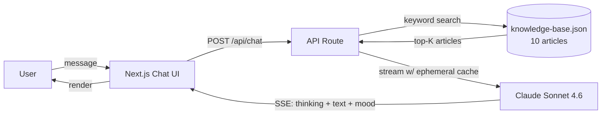

# Customer Support Agent — Streaming Claude, Extended Thinking, Auto-Escalation

> **A production-shape support chatbot: RAG over a 10-article knowledge base, mood detection on every reply, an auto-escalation banner when frustration doesn't resolve, extended-thinking blocks streamed live, and ephemeral prompt caching to keep the bill flat.**

<p align="center"></p>

<p align="center">
  
  
  
  
  
</p>

## Why this exists

Most "AI support" demos are one-shot Q&A with no state, no citations, and no way to catch the user hitting the roof before they churn. This one covers all three: every reply is classified `frustrated / neutral / happy` and shown as an emoji badge, unresolved frustration flips an auto-escalation banner offering a human handoff, and the extended-thinking panel streams Claude's reasoning live so a support engineer can audit what the model was doing before it answered. RAG over a 10-article KB with inline source chips so nothing is hallucinated policy.

## Try it in 60 seconds

```bash
git clone https://github.com/Danush-Aries/customer-support-agent.git
cd customer-support-agent
npm install

cp .env.example .env.local            # add ANTHROPIC_API_KEY
npm run dev                           # http://localhost:3000
```

## How it works

- **`app/api/chat/route.ts`** — Server-Sent Events streaming endpoint. Runs keyword search over `data/knowledge-base.json`, picks top-K articles, passes them as context to Claude Sonnet 4.6 with `cache_control: ephemeral` on system prompt + KB block so the input cost after turn 1 drops to near-zero.
- **Extended thinking (streaming)** — `thinking` deltas from the API are piped into a collapsible panel in the message bubble; the answer streams in parallel underneath.
- **Mood classifier** — each reply is tagged with a mood token that the UI maps to an emoji badge; simple, cheap, and works reliably enough to drive escalation logic.
- **Auto-escalation banner** — when N consecutive replies come back `frustrated`, the UI surfaces a "talk to a human" CTA. Threshold is a single constant.
- **RAG (`lib/rag.ts`)** — keyword search (deterministic, no embeddings, no vector DB). Fine for a 10-article KB; swap in `pgvector` when you outgrow it.



## Screenshots

| Streaming reply with mood badge | Extended thinking panel | Escalation banner |
|---|---|---|
|  |  |  |

## Features

- **Real-time streaming** — Claude responses over Server-Sent Events
- **RAG knowledge base** — keyword search across 10 support articles, cited inline as source chips
- **Mood detection** — every reply classified `frustrated` / `neutral` / `happy`, surfaced as an emoji badge
- **Auto-escalation banner** — when frustration looks unresolved, prompts the user to talk to a human
- **Extended thinking** — Claude's reasoning streamed live into a collapsible panel
- **Prompt caching** — system prompt + KB context flagged `cache_control: ephemeral` to cut input cost
- **Polished Tailwind UI** — dark-mode CSS vars, custom animations, auto-resize textarea

## Environment

| Variable | Required | Description |
|---|---|---|
| `ANTHROPIC_API_KEY` | Yes | Get it at [console.anthropic.com](https://console.anthropic.com) |

## Knowledge base topics

Password reset · Cancellation & refunds · Slow-performance troubleshooting · Subscription upgrades · 2FA · Data export & account deletion · API access · Team management · Mobile app issues · Contacting support.

## Project structure

```
├── app/
│   ├── api/chat/route.ts   # Streaming API route (Claude + RAG)
│   ├── page.tsx            # Main chat UI page
│   ├── layout.tsx          # Root layout
│   └── globals.css         # Tailwind base + CSS variables
├── components/
│   ├── ChatMessage.tsx     # Message bubble with mood / thinking / citations
│   └── ChatInput.tsx       # Auto-resize textarea + send
├── data/
│   └── knowledge-base.json # 10 support articles (account, billing, security, …)
└── lib/
    ├── rag.ts              # Keyword search over the KB
    └── utils.ts            # Tailwind class merge
```

## Stack

Next.js 14 (App Router) · TypeScript · `@anthropic-ai/sdk` with streaming + extended thinking + `cache_control: ephemeral` · Tailwind CSS + Radix UI · lucide-react.

## Contributing

PRs welcome. Add articles in `data/knowledge-base.json` — they're indexed on server start; no rebuild needed. New reply classifiers (sentiment, intent, PII) plug into the streamed response handler in `app/api/chat/route.ts`.

## License

MIT — see [LICENSE](./LICENSE).

---

### More from Danush

- [ponytail-for-python](https://github.com/Danush-Aries/ponytail-for-python) — code intelligence for Python codebases
- [Agentic_Systems](https://github.com/Danush-Aries/Agentic_Systems) — reference implementations of agent patterns
- [autonomous-coding-agent](https://github.com/Danush-Aries/autonomous-coding-agent) — full-auto engineering agent
- [computer-use-agent](https://github.com/Danush-Aries/computer-use-agent) — Claude drives your desktop via VNC
- [browser-automation-agent](https://github.com/Danush-Aries/browser-automation-agent) — Claude drives Playwright
- [blinkchat](https://github.com/Danush-Aries/blinkchat) — realtime chat with vibes
