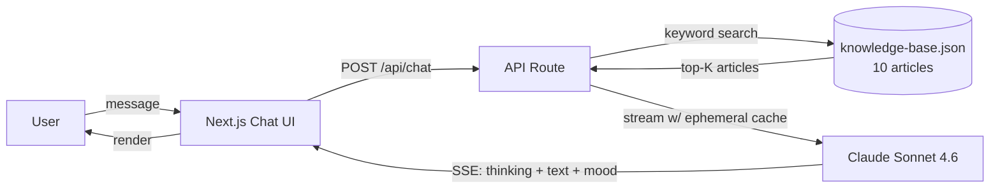

<div align="center">
  
</div>

<div align="center">


</div>

A streaming customer-support chat built with **Next.js 14** and **Claude Sonnet 4.6** — RAG over a 10-article knowledge base, mood-aware UI, extended-thinking blocks, and ephemeral prompt caching.

## ✨ Features

- 🌊 **Real-time streaming** — Claude responses over Server-Sent Events
- 🔎 **RAG knowledge base** — keyword search across 10 support articles, cited inline as source chips
- 😀 **Mood detection** — every reply classified `frustrated` / `neutral` / `happy`, surfaced as an emoji badge
- 🚨 **Auto-escalation banner** — when frustration looks unresolved, prompts the user to talk to a human
- 🧠 **Extended thinking** — Claude's reasoning streamed live into a collapsible panel
- 💸 **Prompt caching** — system prompt + KB context flagged `cache_control: ephemeral` to cut input cost
- 🎨 **Polished Tailwind UI** — dark-mode CSS vars, custom animations, auto-resize textarea

## 🏗️ Architecture



## 🚀 Quick start

```bash
git clone https://github.com/Dhanush-Aries/customer-support-agent.git
cd customer-support-agent
npm install

cp .env.example .env.local            # then add ANTHROPIC_API_KEY
npm run dev                           # http://localhost:3000
```

## 🛠️ Tech stack

**Next.js 14** (App Router) · **@anthropic-ai/sdk** with streaming + extended thinking · **Tailwind CSS** + Radix UI · **TypeScript**

## ⚙️ Environment

| Variable | Required | Description |
|---|---|---|
| `ANTHROPIC_API_KEY` | ✅ | Get it at [console.anthropic.com](https://console.anthropic.com) |

## 📂 Project structure

```
├── app/
│   ├── api/chat/route.ts   # Streaming API route (Claude + RAG)
│   ├── page.tsx            # Main chat UI page
│   ├── layout.tsx          # Root layout
│   └── globals.css         # Tailwind base + CSS variables
├── components/
│   ├── ChatMessage.tsx     # Message bubble with mood / thinking / citations
│   └── ChatInput.tsx       # Auto-resize textarea + send
├── data/
│   └── knowledge-base.json # 10 support articles (account, billing, security, …)
└── lib/
    ├── rag.ts              # Keyword search over the KB
    └── utils.ts            # Tailwind class merge
```

## 📚 Knowledge base topics

Password reset · Cancellation & refunds · Slow-performance troubleshooting · Subscription upgrades · 2FA · Data export & account deletion · API access · Team management · Mobile app issues · Contacting support

## 📜 License

MIT — see [LICENSE](./LICENSE)

---

<sub>Part of the <a href="https://github.com/Dhanush-Aries">Dhanush Shankar</a> AI engineering portfolio.</sub>
